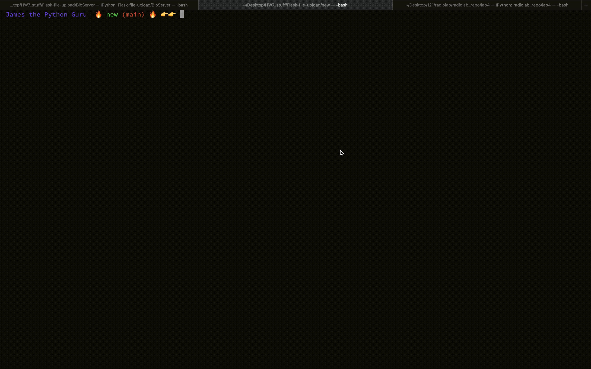

# BibServer 
A simple web app to store BibTeX files and query them using a Flask Framework.

To use this code start by cloning the repository and moving into the head directory. From there all that is required is a few packages, please check `requirements.txt` for what packages need to be installed via pip.

To use the server run 

`python app.py`

in your terminal. From there a link will be provided with a localhost port of 5000, copy the url into your browser of choice. 

Once you are on the Flask webpage usage is fairly explanatory. You can upload a BibTeX file of your choice and add it to a collection you'd like to name. Think of the collection name as an alias name for the file. You can look at how it is added to the total database by clicking on the link at the top of the page or you can make a query on it by clicking on the corresponding link. Query instructions are provided on the query page, results that fit the criterion will pop up below.

To close out just `CTRL + C` in your terminal, and to re-open the server you can start process again. All files should remain in the database once you reopen the server. To start fresh delete the sqlite database file in the directory and remove unwanted files from the `uploads` folder

A choppy gif below is provided for a usage example:

  

